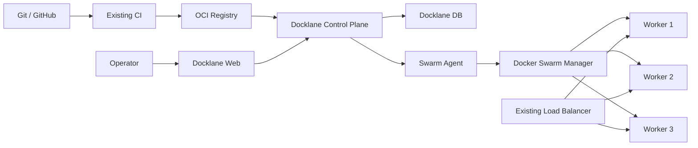

# Docklane

**Lightweight, self-hosted deployment control plane for cost-constrained VM infrastructure.**

Docklane은 관리형 컨테이너 플랫폼 도입이 부담스러운 환경에서 기존 Linux VM과 Docker Swarm을 활용해 배포, 확장, 롤백, 노드 운영, 릴리스 이력과 감사 로그를 하나의 UI에서 관리하기 위한 오픈소스 프로젝트입니다.

> Status: **Specification / pre-alpha**  
> 현재 저장소는 설계 단계입니다. 운영 환경 사용을 권장하지 않습니다.

## Why Docklane?

기존 VM을 직접 운영하면 비용은 낮출 수 있지만 서버마다 런타임과 배포 스크립트를 관리하고, 장애·증설·롤백·배포 이력을 별도로 처리해야 합니다.

Docklane은 Docker Swarm이 이미 제공하는 오케스트레이션 기능을 재구현하지 않습니다.

- **Docker Swarm**: desired state, scheduling, replica, service discovery, rolling update, rollback
- **Docklane**: release, deployment workflow, health verification, historical redeploy, audit, node bootstrap, operational UI
- **Existing CI**: source build, test, container image build/push
- **Existing Registry**: OCI image storage
- **Existing Load Balancer**: external traffic entry point

## Goals

- 기존 VM을 최대한 재사용하는 저비용 구조
- 여러 호스트의 Docker workload를 하나의 화면에서 관리
- Rolling deployment와 자동/수동 rollback
- Image tag뿐 아니라 digest 기반 release 추적
- Node drain, replica scale 등 반복 운영 작업 단순화
- Deployment ticket과 audit log를 통한 변경 추적
- 특정 Cloud Provider에 강하게 종속되지 않는 core architecture

## Non-goals

Docklane은 다음을 목표로 하지 않습니다.

- Kubernetes 대체 구현
- 자체 container runtime / scheduler / overlay network
- VM provisioning 플랫폼
- CI 또는 container registry 대체
- Stateful database orchestration
- Service mesh 또는 범용 observability 플랫폼

## Architecture



Docklane은 Docker Engine API를 외부에 직접 노출하지 않고, Swarm manager 내부의 제한된 agent를 통해 필요한 작업만 수행하는 방향을 기본 설계로 합니다.

자세한 내용은 [Architecture](docs/ARCHITECTURE.md)를 참고하세요.

## MVP

첫 번째 동작 가능한 버전은 다음 흐름을 UI에서 수행하는 것을 목표로 합니다.

1. Swarm cluster와 node 상태 조회
2. Service / task / replica 상태 조회
3. Replica scale 및 service restart
4. Node drain / activate
5. Release 등록 및 image digest 추적
6. Rolling deployment
7. Deployment health verification
8. Automatic rollback
9. Manual rollback / historical redeploy
10. Deployment history / audit log
11. One-time token 기반 node bootstrap

전체 요구사항은 [Specification](docs/SPEC.md), 개발 순서는 [Roadmap](docs/ROADMAP.md)을 참고하세요.

## Concept Mapping

| Docklane | Docker |
| --- | --- |
| Cluster | Swarm |
| Node | Swarm node |
| Application | Stack 또는 서비스 묶음 |
| Service | Swarm service |
| Instance | Task / container |
| Scale | Service replicas |
| Deploy | Service update / stack deploy |
| Rollback | Service rollback / historical redeploy |
| Config | Docker config |
| Secret | Docker secret |

## Planned Stack

- **Web**: Next.js, TypeScript
- **API**: NestJS, TypeScript, Zod
- **Database**: MySQL / MariaDB
- **Agent**: TypeScript/Node.js first, Go 검토 가능
- **Runtime**: Docker Engine + Swarm
- **Repository**: Monorepo

예상 구조:

```text
.
├── apps/
│   ├── web/
│   ├── api/
│   └── agent/
├── packages/
│   ├── contracts/
│   ├── docker/
│   ├── config/
│   └── ui/
├── deploy/
├── docs/
└── scripts/
```

## Design Principles

1. **Reuse before rebuild** — Docker가 제공하는 기능을 다시 만들지 않습니다.
2. **Build and deploy are separate** — Docklane은 image build server가 아닙니다.
3. **Immutable releases** — 운영 배포는 가능한 한 image digest를 기록합니다.
4. **One process per container** — Node.js cluster/PM2보다 Swarm replica를 기본 확장 단위로 봅니다.
5. **Safe by default** — Docker socket/TCP daemon을 외부에 직접 노출하지 않습니다.
6. **Audit operational changes** — 배포, rollback, scale, drain 같은 mutation을 추적합니다.
7. **Provider adapters** — NCP, AWS 등 provider-specific 기능은 core domain과 분리합니다.

## Security

Docklane은 인프라 변경 권한을 가지는 control plane을 지향하므로 일반 웹 애플리케이션보다 높은 보안 수준이 필요합니다.

초기 보안 원칙:

- Docker TCP 2375 외부 노출 금지
- Control Plane ↔ Agent mTLS
- Agent arbitrary shell execution 금지
- Bootstrap token 일회성 및 만료
- Secret 값 조회/로그 출력 금지
- RBAC와 mutation audit
- Registry credential 암호화 저장
- Manager quorum 상실 시 mutation 차단

보안 취약점 제보 정책은 [SECURITY.md](SECURITY.md)를 참고하세요.

## Documentation

- [Product & Technical Specification](docs/SPEC.md)
- [Architecture](docs/ARCHITECTURE.md)
- [Roadmap](docs/ROADMAP.md)
- [Security Policy](SECURITY.md)
- [Contributing](CONTRIBUTING.md)

## References

Docklane 설계는 Docker의 공식 Swarm 기능을 기반으로 합니다.

- [Swarm mode](https://docs.docker.com/engine/swarm/)
- [Deploy services to a swarm](https://docs.docker.com/engine/swarm/services/)
- [Deploy a stack to a swarm](https://docs.docker.com/engine/swarm/stack-deploy/)
- [Docker secrets](https://docs.docker.com/engine/swarm/secrets/)
- [Docker configs](https://docs.docker.com/engine/swarm/configs/)

> `docker stack deploy`는 최신 Compose Specification 전체가 아니라 legacy Compose v3 형식의 호환 범위를 사용합니다. Docklane의 Stack 편집/검증 기능도 Swarm-compatible subset을 기준으로 설계합니다.

## License

[MIT License](LICENSE)
