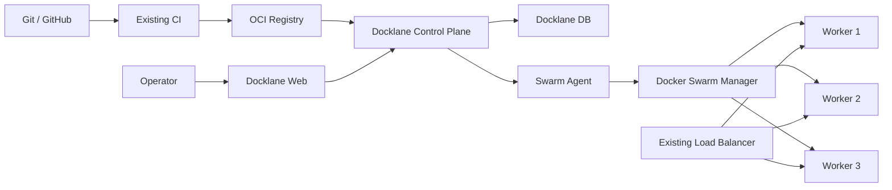

# Docklane

**Lightweight, self-hosted deployment control plane for cost-constrained VM infrastructure.**

Docklane은 관리형 컨테이너 플랫폼 도입이 부담스러운 환경에서 기존 Linux VM과 Docker Swarm을 활용해 배포, 확장, 롤백, 노드 운영, 릴리스 이력과 감사 로그를 하나의 UI에서 관리하기 위한 오픈소스 프로젝트입니다.

> Status: **Specification / pre-alpha**  
> 현재 저장소는 설계 단계이며 운영 환경 사용을 권장하지 않습니다.

## Why Docklane?

기존 VM을 직접 운영하면 비용은 낮출 수 있지만 서버마다 런타임과 배포 스크립트를 관리하고, 장애·증설·롤백·배포 이력을 별도로 처리해야 합니다.

Docklane은 Docker Swarm이 이미 제공하는 오케스트레이션 기능을 재구현하지 않습니다.

- **Docker Swarm**: desired state, scheduling, replica, service discovery, rolling update, rollback
- **Docklane**: release, deployment workflow, target verification, recovery/reconciliation, audit, operational UI
- **Existing CI**: source build, test, container image build/push
- **Existing Registry**: OCI image storage
- **Existing Load Balancer**: external traffic entry point

## MVP Scope

첫 번째 구현은 범위를 의도적으로 좁힙니다.

- single Swarm cluster
- application당 **단일 stateless replicated service**
- existing OCI registry
- existing external load balancer
- Swarm ingress routing mesh
- digest-pinned release
- Web UI 기반 deploy / rollback / scale / drain
- 모든 mutation의 RBAC, serialization, audit
- API/Agent 재시작 후 reconciliation

복수 service Stack, environment promotion, bootstrap automation, provider adapter는 후속 단계로 둡니다.

## Core Safety Contract

배포 성공은 단순히 replica 수와 health 200만으로 판단하지 않습니다.

```text
target digest/spec matches
AND
Swarm update reached terminal success
AND
all expected tasks converged to target version
AND
application health remains stable for verification window
```

Rollback 역시 명령 수락이 아니라 이전 spec으로 실제 수렴하고 복구 health 검증까지 완료되어야 성공으로 기록합니다.

Deploy, rollback, scale, restart 같은 동일 service 변경은 하나의 service-level mutation lock으로 직렬화합니다. 외부 CLI 변경도 Docker service version/spec 비교를 통해 충돌로 감지합니다.

## Goals

- 기존 VM을 최대한 재사용하는 저비용 구조
- 여러 호스트의 Docker workload를 하나의 화면에서 관리
- Rolling deployment와 검증 가능한 rollback
- Digest 기반 immutable release 추적
- Node drain, replica scale 등 반복 운영 작업 단순화
- API/Agent 장애 후 실제 Swarm 상태와 재조정
- Deployment ticket과 audit log를 통한 변경 추적
- 특정 Cloud Provider에 강하게 종속되지 않는 core architecture

## Non-goals

- Kubernetes 대체 구현
- 자체 container runtime / scheduler / overlay network
- VM provisioning 플랫폼
- CI 또는 container registry 대체
- Stateful database orchestration
- DB schema/data rollback
- Service mesh 또는 범용 observability 플랫폼

## Architecture



Docklane은 Docker Engine API를 외부에 직접 노출하지 않고, Swarm manager 내부의 제한된 **Go agent**를 통해 필요한 작업만 수행합니다. Agent는 별도 Node.js runtime 없이 단일 바이너리로 배포하는 것을 기본으로 합니다.

자세한 내용은 [Architecture](docs/ARCHITECTURE.md)를 참고하세요.

## Concept Mapping

| Docklane | Docker |
| --- | --- |
| Cluster | Swarm |
| Node | Swarm node |
| Deployment Target | Bound Swarm service |
| Service | Swarm service |
| Instance | Task / container |
| Scale | Service replicas |
| Deploy | Service update |
| Immediate rollback | Service rollback |
| Historical redeploy | New deployment from stored release/spec |
| Config | Docker config |
| Secret | Docker secret |

## Planned Stack

- **Web**: Next.js, TypeScript
- **API**: NestJS, TypeScript, Zod
- **Database**: MySQL / MariaDB
- **Agent**: Go
- **Agent ↔ Control Plane Contract**: OpenAPI, HTTPS + mTLS
- **Runtime**: Docker Engine + Swarm
- **Repository**: Monorepo (TypeScript + Go)

## Design Principles

1. **Reuse before rebuild** — Docker가 제공하는 기능을 다시 만들지 않습니다.
2. **Build and deploy are separate** — Docklane은 image build server가 아닙니다.
3. **Immutable releases** — 운영 Release는 image digest를 필수로 고정합니다.
4. **Target before health** — 목표 digest/spec 반영 여부를 먼저 확인하고 health를 검증합니다.
5. **Serialize mutations** — 동일 service의 deploy/rollback/scale/restart를 직렬화합니다.
6. **Reconcile after failure** — 이벤트만 믿지 않고 inspect/polling으로 실제 상태를 재조정합니다.
7. **One process per container** — Node.js cluster/PM2보다 Swarm replica를 기본 확장 단위로 봅니다.
8. **Safe by default** — Docker socket/TCP daemon을 외부에 직접 노출하지 않습니다.
9. **Audit operational changes** — 모든 인프라 mutation을 추적합니다.
10. **Provider adapters** — NCP, AWS 등 provider-specific 기능은 core domain과 분리합니다.
11. **Small agent footprint** — Agent는 Go 단일 바이너리로 배포하고 Docker manager에 추가 runtime 의존성을 최소화합니다.
12. **Contract over shared code** — TypeScript Control Plane과 Go Agent는 OpenAPI 계약을 공유하고 언어별 내부 타입 구현을 분리합니다.

## Validation Profiles

### Functional PoC

```text
manager-01
worker-01
worker-02
```

기능 및 worker 장애/재배치 검증용입니다. Manager HA를 검증하는 구성이 아닙니다.

### Operational Readiness

최소 3 managers에서 다음을 별도로 검증합니다.

- manager leader loss
- quorum loss
- network partition
- agent failover/reconnect
- Swarm state backup/restore
- Docklane DB/암호화 키 복구
- 실제 LB 경유 rolling deployment
- start-first 시 capacity 부족

## Security

초기 mutation 기능부터 다음을 필수로 적용합니다.

- 기본 인증/RBAC/resource scope 검사
- Docker TCP 2375 외부 노출 금지
- Control Plane ↔ Agent mTLS
- 인증서 발급/갱신/폐기 lifecycle
- Agent arbitrary shell execution 금지
- Agent operation별 허용 field/target 검증
- Secret 값 조회/로그 출력 금지
- Registry credential 암호화 저장
- Manager quorum 상실 시 mutation 차단

보안 취약점 제보 정책은 [SECURITY.md](SECURITY.md)를 참고하세요.

## Documentation

- [Product & Technical Specification](docs/SPEC.md)
- [Architecture](docs/ARCHITECTURE.md)
- [Roadmap](docs/ROADMAP.md)
- [Security Policy](SECURITY.md)
- [Contributing](CONTRIBUTING.md)

## References

- [Swarm mode](https://docs.docker.com/engine/swarm/)
- [Deploy services to a swarm](https://docs.docker.com/engine/swarm/services/)
- [Rolling updates](https://docs.docker.com/engine/swarm/swarm-tutorial/rolling-update/)
- [Docker service update](https://docs.docker.com/reference/cli/docker/service/update/)
- [Routing mesh](https://docs.docker.com/engine/swarm/ingress/)
- [Manage nodes](https://docs.docker.com/engine/swarm/manage-nodes/)
- [Docker security](https://docs.docker.com/engine/security/)

> `docker stack deploy`는 최신 Compose Specification 전체가 아니라 legacy Compose v3 형식의 호환 범위를 사용합니다. Stack 지원은 MVP 이후 Swarm-compatible subset으로 제한합니다.

## License

[MIT License](LICENSE)
