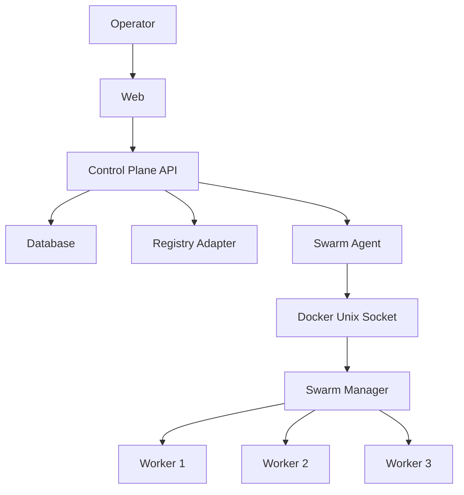
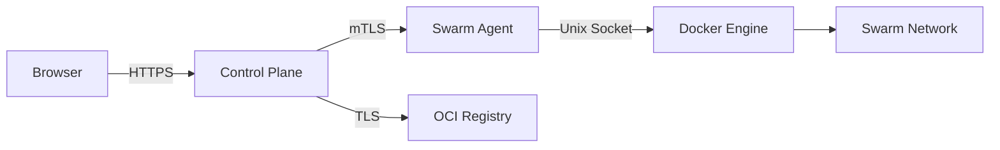
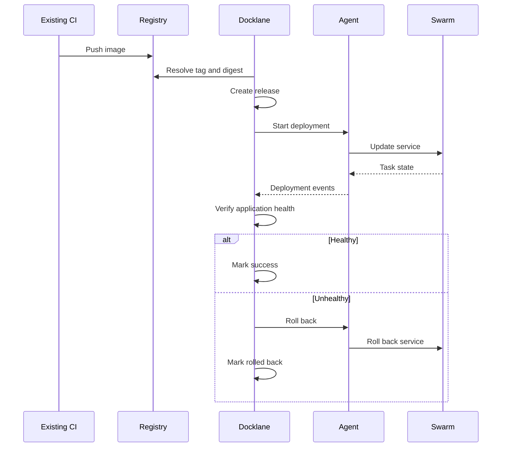
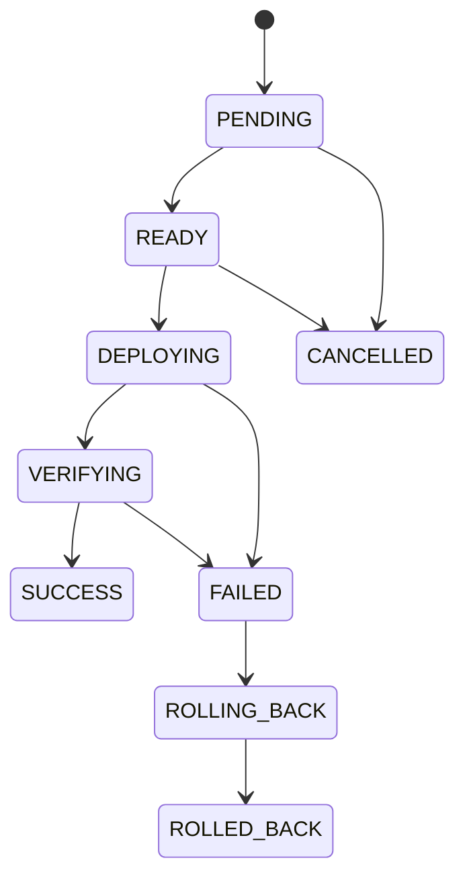

# Architecture

## Overview

Docklane은 Docker Swarm 위에서 동작하는 운영 control plane이다. Scheduler나 container runtime을 직접 구현하지 않고 Docker Engine API와 Swarm desired state를 이용한다.



## Components

### Web

역할:

- dashboard
- cluster/node/service UI
- release/deployment UI
- deployment progress
- audit
- settings

초기 후보: Next.js + TypeScript.

### Control Plane API

역할:

- domain validation
- RBAC
- release/deployment state machine
- deployment lock
- audit
- registry adapter
- agent communication
- health verification orchestration

초기 후보: NestJS + TypeScript + Zod.

### Database

Docker가 현재 runtime state를 보유하고, Docklane DB는 운영 workflow의 source of record 역할을 한다.

DB에 저장하는 대표 정보:

- application metadata
- releases
- deployments
- deployment events
- users/roles
- audit events
- registry configuration
- bootstrap tokens

Docker runtime state를 DB에 복제해 진실의 원천으로 만들지 않는다.

### Swarm Agent

Swarm manager host 또는 manager network 안에서 실행한다.

역할:

- Docker Engine API 접근
- cluster/node/service/task 조회
- service update/scale/rollback
- node drain/activate
- config/secret operation
- event forwarding

Agent는 arbitrary shell command API를 제공하지 않는다.

```text
Control Plane
    │
    │ mTLS
    ▼
Agent
    │
    │ /var/run/docker.sock
    ▼
Docker Engine
```

### Registry Adapter

Core domain과 provider-specific registry API를 분리한다.

초기 interface 예:

```typescript
export interface ContainerRegistryProvider {
  listRepositories(): Promise<Repository[]>;

  listTags(repository: string): Promise<ImageTag[]>;

  resolveDigest(
    repository: string,
    tag: string,
  ): Promise<string>;
}
```

초기 구현 후보:

- Generic OCI Registry
- NCP Container Registry

후속:

- AWS ECR
- Harbor

## Trust Boundaries



### Required Rules

- Docker daemon TCP 2375를 network에 노출하지 않는다.
- Agent endpoint는 private network를 기본으로 한다.
- Control Plane과 Agent 사이에서 상호 인증을 수행한다.
- Agent operation은 명시적으로 allow-list한다.
- secret value는 Control Plane event/log에 포함하지 않는다.

## Deployment Flow



## Deployment State Machine



## Docker Mapping

| Docklane concept | Docker primitive |
| --- | --- |
| Cluster | Swarm |
| Node | Node |
| Application | Stack / service group |
| Service | Service |
| Instance | Task / container |
| Scaling | Replicas |
| Deploy | Service update / stack deploy |
| Immediate rollback | Service rollback |
| Config | Config |
| Secret | Secret |

## Stack Compatibility

`docker stack deploy`는 최신 Compose Specification 전체와 호환되지 않는다. Docker 공식 문서 기준 legacy Compose v3 format을 사용한다.

따라서 Stack editor는 범용 Compose editor가 아니라 Swarm-compatible configuration editor로 설계한다.

Validation pipeline:

```text
YAML Parse
  -> Schema Validation
  -> Swarm Compatibility Validation
  -> docker stack config
  -> Deployment
```

Production stack은 `build:`에 의존하지 않고 이미 registry에 push된 image를 사용한다.

## Manager Quorum

운영 UI에서 manager quorum을 명시적으로 표시한다.

예:

```text
Managers: 3 / 3 healthy
Quorum required: 2
Fault tolerance: 1
```

Quorum을 잃으면 mutation을 차단한다. 기존 workload가 실행 중인지와 cluster 관리 기능이 가능한지는 별도 상태로 표현한다.

## Deployment Concurrency

동일 service에 동시에 두 deployment를 수행하지 않는다.

Logical lock:

```text
deployment:{clusterId}:{serviceId}
```

MVP에서는 DB advisory/transaction lock 또는 Redis가 이미 존재할 경우 distributed lock을 사용할 수 있다.

## Repository Direction

예상 monorepo:

```text
.
├── apps/
│   ├── web/
│   ├── api/
│   └── agent/
├── packages/
│   ├── contracts/
│   ├── docker/
│   ├── config/
│   └── ui/
├── deploy/
├── docs/
└── scripts/
```

공통 status/DTO/schema는 `packages/contracts`에서 공유한다.

Docker-specific operation은 business service에서 command string으로 직접 조립하지 않고 adapter 뒤에 둔다.

## References

- https://docs.docker.com/engine/swarm/
- https://docs.docker.com/engine/swarm/services/
- https://docs.docker.com/engine/swarm/stack-deploy/
