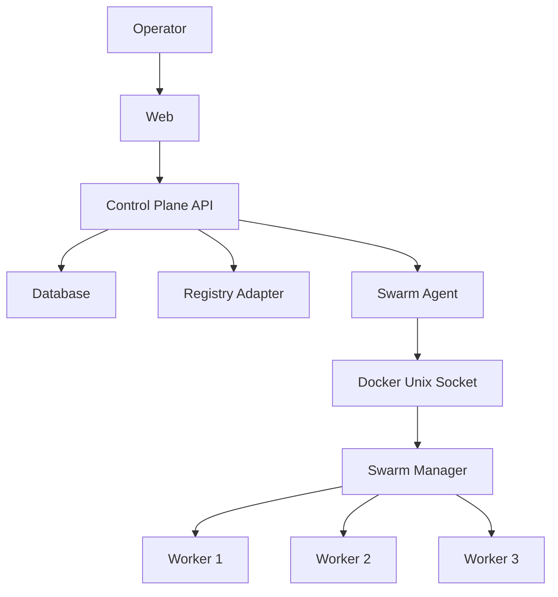
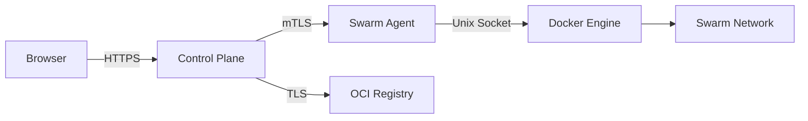
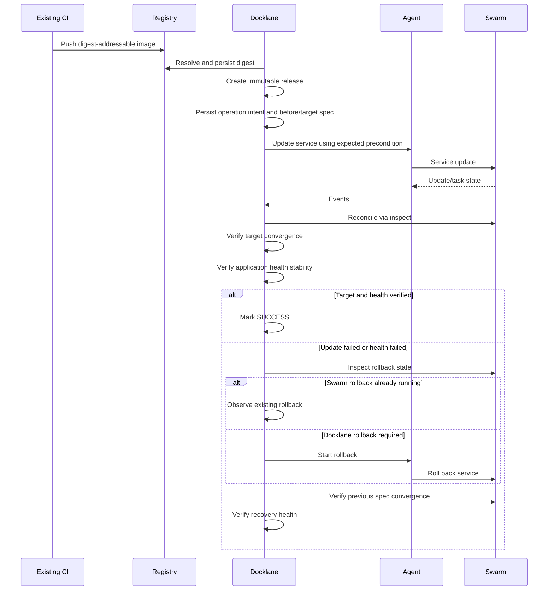
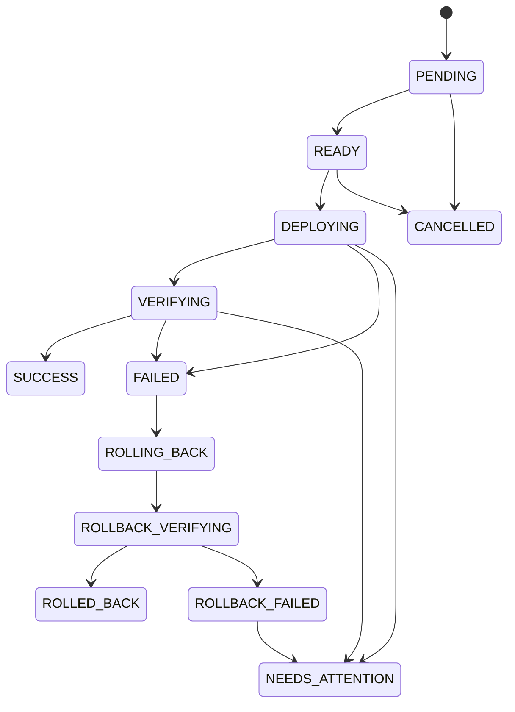

# Architecture

## Overview

Docklane은 Docker Swarm 위에서 동작하는 운영 control plane이다. Scheduler나 container runtime을 직접 구현하지 않고 Docker Engine API와 Swarm desired state를 이용한다.

MVP는 **single cluster + application당 단일 stateless replicated service + ingress routing mesh**로 제한한다.



## Components

### Control Plane API

역할:

- authentication / RBAC / resource scope
- release/deployment state machine
- service-level mutation coordinator
- durable operation intent
- reconciliation
- audit
- registry adapter
- agent communication
- target/health verification

### Database

Docker가 runtime state의 source of truth이고, Docklane DB는 **operation intent와 운영 이력**의 source of record다.

저장:

- applications
- deployment targets
- releases
- deployments
- operation intents
- deployment events
- users/roles
- audit events
- registry configuration

runtime state를 DB 값만으로 판단하지 않는다. non-terminal operation은 Docker inspect 결과와 항상 재조정한다.

### Swarm Agent

Agent 구현 언어는 **Go**로 고정한다.

선택 이유는 raw request 처리 성능보다 운영 특성에 있다.

- 단일 바이너리 배포
- manager host에 별도 Node.js runtime 불필요
- 작은 runtime footprint
- 장기 실행 daemon에 적합
- Docker Engine API와의 자연스러운 연동
- manager별 agent 배포/업그레이드 단순화

Agent는 arbitrary Docker proxy가 아니다.

허용된 high-level operation만 제공한다.

```text
inspectCluster
inspectService
inspectTasks
scaleService
restartService
updateServiceImage
rollbackService
drainNode
activateNode
```

사용자가 전달한 shell command, Docker CLI argument, 전체 service spec을 그대로 실행하지 않는다.

```text
NestJS Control Plane
    │
    │ HTTPS + JSON
    │ mTLS
    ▼
Go Agent
    │
    │ Docker Engine API
    ▼
/var/run/docker.sock
```

초기 Agent protocol은 HTTP/JSON을 사용한다. Control Plane과 Agent 간 요청/응답 계약은 OpenAPI 문서를 source of truth로 두며, TypeScript와 Go가 동일 소스 코드를 직접 공유하지 않는다.

gRPC는 streaming 또는 protocol 성능 요구가 실제로 확인될 경우 후속 검토한다.

## Trust Boundaries



필수 규칙:

- Docker daemon TCP 2375 외부 노출 금지
- Agent private endpoint
- Swarm control/data-path 통신은 허가된 cluster node의 trusted/private network로 제한
- TCP 2377, TCP/UDP 7946, UDP 4789 또는 설정된 data-path port의 public/untrusted 접근 차단
- mTLS certificate issuance/rotation/revocation 정의
- Agent operation/field/target validation
- secret value event/log 금지
- mutation은 API와 Agent 양쪽에서 authorization boundary 검증

## Domain Separation

```text
Application
    │
    ├── Release (environment independent)
    │
    └── DeploymentTarget
            │
            └── Swarm Service binding
```

MVP에서는 DeploymentTarget 하나가 replicated Swarm service 하나를 가리킨다.

이 구조를 통해 Release를 특정 cluster/service ID에 묶지 않고, 환경별 target binding을 분리한다.

## Deployment Flow



## Deployment State Machine



명령 수락과 작업 완료를 분리한다.

## Success Verification

배포 전에 `beforeSpec`과 `targetSpec`을 비교한다.

### No-op

두 spec이 동일하면 Docker update를 실행하지 않는다. 이 경우 Swarm `UpdateStatus`가 새로 생성되거나 `completed`가 되는 것을 성공 조건으로 요구하지 않는다.

```text
current spec == target spec
AND
service image == target digest
AND
all expected running tasks use target digest/spec
AND
desired == expected running replicas
AND
application health stable for configured window
AND
no external conflict
```

이면 no-op `SUCCESS`로 기록한다.

### Mutating update

실제 spec 변경이 있을 때만 다음 조건을 적용한다.

```text
service image == target digest
AND
Swarm update state == completed
AND
all expected running tasks converged to target
AND
desired == expected running replicas
AND
application health stable for configured window
AND
service version/spec still matches expected operation
```

External LB health 하나만으로 task별 version convergence를 대체하지 않는다.

## Mutation Coordination

동일 service의 모든 변경:

```text
deploy
rollback
historical redeploy
scale
restart
```

을 동일 lock namespace로 직렬화한다.

```text
mutation:{clusterId}:{dockerServiceId}
```

각 mutation 시작 시:

- Docker service Version.Index
- beforeSpec
- targetSpec
- operationId

를 기록한다.

호출 직전/완료 전 service version/spec이 기대와 다르면 외부 변경 충돌로 처리하고 자동 덮어쓰지 않는다.

Node mutation은 node 자체 lock뿐 아니라 영향 service lock을 함께 사용한다. 저장된 non-terminal node operation이 다른 node에 있더라도 동일 service를 영향 대상으로 포함하면 새 node mutation을 차단한다.

## Durable Execution

Docker update 요청 직후 API가 종료될 수 있으므로 operation intent를 mutation 전 저장한다.

재시작 후:

```text
Find non-terminal operations
 -> Inspect Docker state
 -> Compare beforeSpec / targetSpec / currentSpec
 -> Inspect update/task state
 -> Resume verification or rollback
 -> Do not replay blindly
```

Docker event stream은 progress 최적화용이며 복구 source of truth가 아니다.

## Rollback Ownership

Swarm의 `failure_action: rollback`과 Docklane application health 기반 rollback이 공존할 수 있다.

따라서 Docklane은 inspect 결과로 다음을 구분한다.

- Swarm rollback already started
- target update still active
- target update failed before any change
- partial update requiring Docklane rollback
- rollback failed

Rollback은 previous spec/task convergence와 recovery health를 검증한 뒤 완료한다.

## Networking

MVP는 ingress routing mesh만 지원한다.

```text
External LB
  -> Published port on Swarm node
  -> Routing mesh
  -> Service task
```

host publishing mode는 후속 지원한다.

실제 PoC에서 반드시 LB 경유 traffic을 사용해:

- error rate
- connection behavior
- startup delay
- mixed old/new version window

를 측정한다.

## Capacity

`start-first`는 old/new task가 동시에 존재할 capacity가 필요하다.

Capacity pre-check는 scheduler replacement가 아니라 conservative guard다.

```text
Service target
  -> current non-terminal task reservations
  -> ready/active nodes
  -> placement/platform filter
  -> per-node free reservation capacity
  -> SUFFICIENT / INSUFFICIENT / UNKNOWN
```

확실하게 부족한 경우만 `INSUFFICIENT`로 차단한다. Reservation 또는 placement 의미를 충분히 해석할 수 없으면 `UNKNOWN`으로 반환하고 Docker Swarm이 최종 scheduling을 수행한다.

현재 evaluator는 CPU/Memory reservation, node/engine label constraint, node id/hostname/ip/role/platform, placement platform, max replicas per node를 고려한다. 플랫폼은 SwarmKit과 동일하게 x86_64/amd64, aarch64/arm64 alias를 정규화하고 빈 image platform 필드는 wildcard로 처리한다. max-replicas 계산은 resource reservation 점유와 active replica slot 집계를 분리한다. Generic resource reservation 또는 지원하지 않는 constraint는 `UNKNOWN`이다.

Scale-up은 필요한 추가 replica를 검사하고, restart는 `start-first` update parallelism만큼의 temporary overlap을 추가로 계산한다.

capacity가 부족하다고 정책을 자동으로 `stop-first`로 바꾸지 않는다.

## Manager Quorum

### Functional PoC

```text
manager-01
worker-01
worker-02
```

기능 검증용이며 manager HA를 제공하지 않는다.

### Operational Readiness

최소 3 managers로 다음을 검증한다.

- leader loss
- manager 1대 loss
- quorum loss
- network partition
- Agent reconnect/failover
- Swarm state backup/restore

Quorum 상실 시 running workload 상태와 management mutability를 별도로 표시하고 mutation을 차단한다.

## Bootstrap Credential Boundary

Docklane bootstrap token과 Docker Swarm native join token을 동일 credential로 취급하지 않는다.

Docklane token은 one-time/TTL/target scope를 가진다.

Native join token은 Docker lifecycle을 따르며 별도로 rotate해야 무효화된다.

Bootstrap 자동화는 core deployment path 검증 이후 구현한다.

## Docker Mapping

| Docklane concept | Docker primitive |
| --- | --- |
| Cluster | Swarm |
| Node | Node |
| DeploymentTarget | Bound service |
| Service | Service |
| Instance | Task/container |
| Scale | Service replicas |
| Deploy | Service update |
| Immediate rollback | Service rollback |
| Config | Config |
| Secret | Secret |

## Stack Support

Stack은 MVP 이후다.

`docker stack deploy`는 최신 Compose Specification 전체가 아니라 Docker가 지원하는 legacy Compose v3 호환 범위를 사용한다.

Stack editor 추가 시:

```text
YAML Parse
 -> Schema Validation
 -> Swarm Compatibility Validation
 -> docker stack config
 -> Deployment
```

production stack에서 `build:`는 지원하지 않는다.

## References

- https://docs.docker.com/engine/swarm/
- https://docs.docker.com/engine/swarm/services/
- https://docs.docker.com/reference/cli/docker/service/update/
- https://docs.docker.com/reference/cli/docker/system/events/
- https://docs.docker.com/engine/swarm/ingress/
- https://docs.docker.com/engine/swarm/admin_guide/
- https://docs.docker.com/engine/security/
- https://docs.docker.com/engine/swarm/swarm-tutorial/


## Agent Implementation

초기 구현 기준:

```text
Language        Go
Packaging       Single Linux binary
Process model   Long-running daemon
Transport       HTTPS + JSON
Authentication  mTLS
Contract        OpenAPI
Docker access   Local Unix socket
Service manager systemd
```

Agent는 manager host의 `/var/run/docker.sock`에 로컬로 접근한다.

배포 예시:

```text
/usr/local/bin/docklane-agent
/etc/docklane/agent.yaml
/etc/docklane/pki/...
```

systemd가 process lifecycle을 관리하고 Agent 자체에서 process supervisor를 중복 구현하지 않는다.

운영 HA 단계에서는 각 Swarm manager에 Agent를 배치할 수 있도록 stateless에 가깝게 설계한다. 영속적인 deployment intent와 audit의 source of record는 Control Plane DB이며, Agent 로컬 상태를 복구의 source of truth로 사용하지 않는다.

## Cross-language Contract

TypeScript Control Plane과 Go Agent 사이의 계약은 OpenAPI로 관리한다.

예상 repository layout:

```text
.
├── apps/
│   ├── web/          # Next.js / TypeScript
│   └── api/          # NestJS / TypeScript
├── agent/            # Go
├── contracts/
│   └── agent.openapi.yaml
├── packages/
│   ├── config/
│   └── ui/
└── docs/
```

OpenAPI 변경 시 TypeScript client와 Go server model의 호환성을 CI에서 검증한다.
